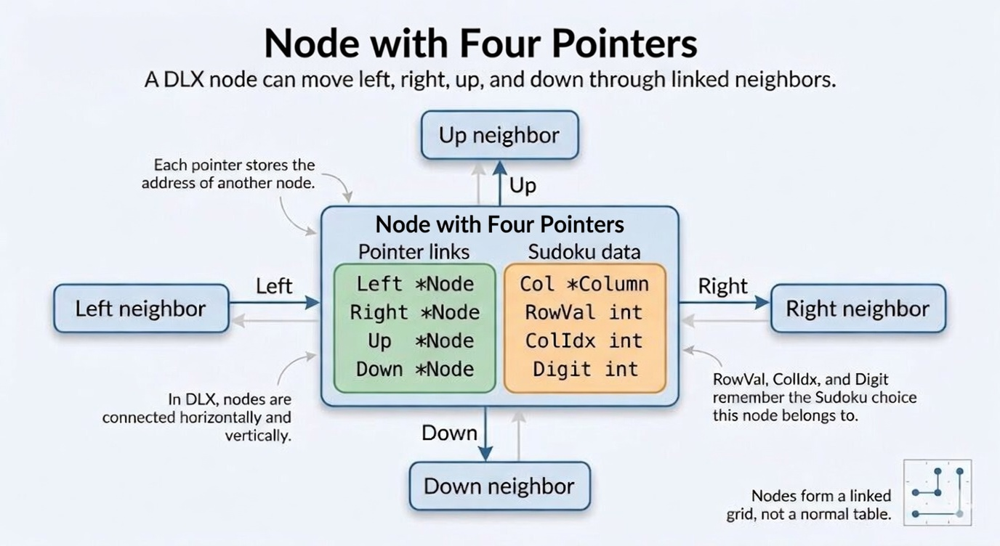

# Go Sudoku Solver

A Sudoku solver implemented in Go using **Knuth's Algorithm X (Exact Cover)** with **Dancing Links (DLX)**. All code lives in a single `main.go`, read top-to-bottom with helpers at the bottom.

## Features

- **Algorithm X (Exact Cover)**: Formulates Sudoku as an exact cover problem and solves it with Dancing Links.
- **Grading compliant**: Prints only the final solution or `Error` for invalid boards.
- **Dependency-free**: Uses only `os` and `fmt`.
- **Robust validation**: Checks dimensions, characters, and minimum clues (at least 17 numbers, 8 unique).

---

## What is Sudoku?

**Sudoku** is a number-placement puzzle on a **9×9 grid**. Some cells are filled in at the start (the **clues** or **givens**); the rest are empty. Your goal is to fill every empty cell with a digit from **1 to 9** so that the completed grid satisfies **three rules at the same time**.

Think of it as a logic puzzle, not a math puzzle — you never multiply or add. You only place digits so that nothing repeats where it should not.

### Rule 1: Rows

Each of the **9 horizontal rows** must contain the digits **1 through 9 exactly once**. No digit may appear twice in the same row.


When checking a row, scan left to right and make sure you see each number from 1 to 9 once — and only once.

### Rule 2: Columns

Each of the **9 vertical columns** must also contain **1 through 9 exactly once**. No digit may appear twice in the same column.


When checking a column, scan top to bottom the same way: every digit 1–9 appears once, with no duplicates.

### Rule 3: Blocks (3×3 boxes)

The 9×9 grid is divided into **nine 3×3 sub-grids** (often called **boxes** or **blocks**). Each block must contain **1 through 9 exactly once** as well.


Thicker lines on the grid mark the block boundaries. When you place a digit, it must be valid for its **row**, its **column**, and its **block** all at once.

### Putting the three rules together

A completed Sudoku is a grid where:

- Every row is a permutation of 1–9.
- Every column is a permutation of 1–9.
- Every 3×3 block is a permutation of 1–9.

This solver takes a partially filled grid (via command-line input), checks that the starting clues are legal, and fills in the rest automatically. The sections below explain **how** it does that.

---

## How It Works

This section is written for **complete beginners**. We start with everyday ideas (lists, links, walking from one item to the next), then build up to Knuth's **Algorithm X** and **Dancing Links (DLX)**, which is how this project solves Sudoku.

**Reading tip:** If you already know Sudoku, you can skim [What is Sudoku?](#what-is-sudoku) above. If you already know linked lists, jump to [From Sudoku rules to Exact Cover](#from-sudoku-rules-to-exact-cover).

---

### What problem are we solving?

Given a 9×9 Sudoku board with some cells already filled (see the [three rules](#what-is-sudoku) above), we must fill every empty cell so that **all three rules hold at once** — valid rows, columns, and blocks together.

There are many ways to try digits and backtrack when you hit a dead end. This project uses a famous, efficient method: turn Sudoku into an **exact cover** problem and search with **Dancing Links**.

---

### Warm-up: values, variables, and pointers (Go)

In Go, a **variable** holds a value. A **pointer** (`*Something`) holds the **address** of a value somewhere else in memory. We use pointers so different parts of the program can refer to the **same** object and update it in one place.

```go
type Person struct {
	Name string
}

alice := Person{Name: "Alice"}
ptr := &alice          // ptr points at alice
ptr.Name = "Alicia"    // changes alice.Name
```

In this solver, almost everything important is a **node** reached through pointers like `node.Right`, `node.Down`.

---

### What is a node? (and what is a vertex?)

In computer science, people often say **node** or **vertex** when they mean one **item** in a structure, with links to other items.

- **Node** — common in linked lists, trees, and graphs.
- **Vertex** — common in graph theory (same idea: a point you can connect to others).

In this project, a **node** is a small struct with links in four directions:

```go
type Node struct {
	Left, Right, Up, Down *Node  // pointers to neighbor nodes
	Col                   *Column
	RowVal, ColIdx, Digit int   // Sudoku meaning: row, column, digit
}
```

Think of each node as a **bead** on a wire. You do not scan a big array; you **follow wires** (`Left`, `Right`, `Up`, `Down`) to visit neighbors.

#### A DLX node up close

The diagram below shows **one** node and how it connects to its neighbors. This is the heart of Dancing Links — not a normal 2D table stored in memory, but a **linked grid** you walk through pointer by pointer.



Read the diagram in two parts:

**1. Pointer links (how you move around)**  
The green section holds four pointers: `Left`, `Right`, `Up`, and `Down`. Each one stores the **address** of another node (that is what `*Node` means — a pointer to a `Node`). Solid arrows in the picture show “this node knows about that neighbor.” The faint arrows going back mean the links work **both ways**: if A points right to B, then B points left to A.

- **Up / Down** — move within a **column** (vertical list of choices for one constraint).
- **Left / Right** — move within a **row** (horizontal ring of the four constraints one Sudoku placement satisfies).

So when the code says `node.Right`, it means: “give me the next node in this horizontal ring.” When it says `node.Down`, it means: “give me the next node below in this column.”

**2. Sudoku data (what this node means)**  
The orange section answers: *which Sudoku placement does this node represent?*

| Field | Meaning |
|-------|---------|
| `RowVal` | Row on the board (0–8) |
| `ColIdx` | Column on the board (0–8) |
| `Digit` | Digit placed there (1–9) |
| `Col` | Which constraint column this node belongs to |

Example: a node with `RowVal = 2`, `ColIdx = 4`, `Digit = 7` belongs to the choice **“put 7 in row 2, column 4.”** That one Sudoku idea is represented by **four** linked nodes in the matrix (cell, row, column, and box constraints) — you hop between them using `Left` and `Right`.

**Beginner takeaway:** A DLX node is a small box with **directions** (four pointers) and a **label** (which row, column, and digit it stands for). The solver never says “look at row 5 of a big array.” It says “start here, follow `Down`, then follow `Right`” — that is **traversal**.

---

### A simple singly linked list (one direction)

Before Dancing Links, picture the simplest linked list: each node only knows the **next** node.

```go
type SimpleNode struct {
	Value int
	Next  *SimpleNode
}

// Build: 10 -> 20 -> 30
n3 := &SimpleNode{Value: 30}
n2 := &SimpleNode{Value: 20, Next: n3}
n1 := &SimpleNode{Value: 10, Next: n2}

// Traverse: start at head, follow Next until nil
for cur := n1; cur != nil; cur = cur.Next {
	fmt.Println(cur.Value) // prints 10, then 20, then 30
}
```

- **Head** — where you **start** traversing (`n1` above). There is no special "head type"; it is just the first pointer you keep.
- **Tail** — the **last** node (`n3` above), where `Next` is `nil`.

Traversal means: **repeat "go to next" until there is no next.**

---

### Doubly linked list (two directions)

A **doubly linked** node knows **both** previous and next. You can walk forward **or** backward.

```go
type DNode struct {
	Value      int
	Prev, Next *DNode
}

a := &DNode{Value: 1}
b := &DNode{Value: 2}
c := &DNode{Value: 3}
// link forward: a <-> b <-> c
a.Next, b.Prev, b.Next, c.Prev = b, a, c, b

// Forward traverse
for cur := a; cur != nil; cur = cur.Next {
	fmt.Println(cur.Value)
}

// Backward traverse from tail
for cur := c; cur != nil; cur = cur.Prev {
	fmt.Println(cur.Value)
}
```

Dancing Links uses **four** pointers per node (`Left`, `Right`, `Up`, `Down`) — like a doubly linked list extended into a **grid**.

---

### Head, sentinel, and "where to start"

Words like **head** show up in two related ways:

1. **List head** — the first node you use to start a walk (e.g. `n1` in the simple list).
2. **Sentinel / dummy head** — a special node that is **not** real data but marks the start/end of a ring. In DLX, each column has a `Head` node that sits at the top of that column's vertical list.

In `main.go`, each column is:

```go
type Column struct {
	Head Node   // sentinel at the top of this column
	Size int    // how many real nodes are below Head
	ID   int
}
```

When we write `col.Head.Down`, we mean: "start at the column's sentinel, then go **down** to the first real option in that column." The loop

```go
for r := col.Head.Down; r != &col.Head; r = r.Down {
	// ...
}
```

means: visit every node in this column **except** the sentinel itself.

There is usually **no separate tail pointer** in DLX. The structure is **circular**: if you keep going `Down`, you eventually wrap back to `Head`.

---

### Circular lists (why "Dancing" Links)

In a **circular** doubly linked list, the last node's `Next` points back to the first, and the first node's `Prev` points to the last. There is no `nil` at the ends — you stop when you recognize you've come **full circle**.

```go
// Three nodes in a horizontal ring: A <-> B <-> C <-> A
a := &Node{}
b := &Node{}
c := &Node{}
a.Left, a.Right = c, b
b.Left, b.Right = a, c
c.Left, c.Right = b, a

// Walk right until we're back at the start
start := a
for cur := start.Right; cur != start; cur = cur.Right {
	// visit cur
}
```

**Cover** and **uncover** in DLX only **rewire pointers** (unlink/link neighbors). Nodes stay in memory; they "dance" in and out of the active structure. That is faster than copying large matrices.

---

### Traversing in four directions (mini DLX)

Each data node sits in **one horizontal ring** (one Sudoku "choice" row) and **one vertical list** (one matrix column). Example of moving around one row of four nodes:

```go
// Suppose 'start' is one node in a horizontal ring of four
for j := start.Right; j != start; j = j.Right {
	// j visits each of the 4 nodes in this row, once
}
```

Vertical walk in a column (skip the sentinel `Head`):

```go
for i := col.Head.Down; i != &col.Head; i = i.Down {
	// i is each option still active in this column
}
```

In `main.go`, `root` is a special node whose horizontal ring lists **all column headers**. When `root.Right == &root`, every column has been covered and the puzzle is solved.

---

### From Sudoku rules to Exact Cover

Knuth's **Algorithm X** solves the **Exact Cover** problem:

> Given a collection of sets and a universe of "things that must be covered," choose a **subset of sets** such that **every** thing is covered **exactly once**, and no two chosen sets overlap.

**Sudoku as exact cover:**

- **Things to cover** = all the rules that must be satisfied (each cell has one digit, each row has each digit once, etc.).
- **Sets (choices)** = "put digit `v` in cell `(r, c)`."
- Each choice touches several rules at once. Pick **81** choices (one per cell) with **no overlap** — that is a valid solution.

#### Jigsaw analogy

1. There are **324 slots** that must be filled (constraints).
2. There are **729 pieces** (every digit in every cell).
3. Each piece covers exactly **4 slots** (cell, row, column, box).
4. Pick **81 pieces** so all slots are filled with no overlap.

#### Why 324 slots? (You only see 81 cells on the board)

A fair question: the grid is **9×9 = 81 cells**, so where does **324** come from?

**Answer:** A **slot** is not a cell on the board. It is **one rule** the solver must satisfy. We list every Sudoku rule explicitly, and there are **four kinds** of rules — each kind contributes **81** slots:

| What you see | What the solver tracks |
|--------------|------------------------|
| **81 cells** on the 9×9 grid | **81** cell rules: “this cell gets exactly one digit” |
| 9 rows | **81** row rules: “in row *r*, digit *d* appears exactly once” (9 rows × 9 digits) |
| 9 columns | **81** column rules: “in column *c*, digit *d* appears exactly once” |
| 9 boxes | **81** box rules: “in box *b*, digit *d* appears exactly once” |

Add them up:

```text
  81   cell rules
+ 81   row rules
+ 81   column rules
+ 81   box rules
────
 324   total slots (constraints)
```

So **324 = 4 × 81**. We are not counting cells four times; we are counting **four separate rule families**, each with 81 members.

**Why are row rules 81, not just 9?**  
Nine rows does **not** mean nine row rules. The row rule is: *each digit 1–9 appears exactly once in that row*. That is **nine separate facts per row** (one per digit). Example slots:

- “Row 3 contains **7** exactly once”
- “Row 3 contains **2** exactly once”
- … and so on for every row and every digit → **9 × 9 = 81** row slots.

The same logic gives **81** column slots and **81** box slots.

**Examples of one slot each:**

| Slot | Plain English |
|------|----------------|
| Cell (4, 7) | The cell at row 4, column 7 must hold **some** digit (exactly one). |
| Row 3, digit 7 | Row 3 must contain **7** exactly once. |
| Column 5, digit 2 | Column 5 must contain **2** exactly once. |
| Box 0 (top-left), digit 9 | The top-left 3×3 box must contain **9** exactly once. |

**Mental picture:**

```text
What you see:              What the solver tracks:
┌─────────────┐            81  → each cell has a number
│  9 × 9 = 81 │           +81  → each row has 1–9 once
│    cells    │           +81  → each column has 1–9 once
└─────────────┘           +81  → each box has 1–9 once
                            ───
                            324 rules to satisfy
```

**Why 729 pieces?**  
A **piece** (candidate) means: “put digit **v** in cell **(r, c)**.” There are 9 choices of row, 9 of column, and 9 of digit: **9 × 9 × 9 = 729** possible placements. Each placement satisfies **4** of the 324 slots at once (its cell, row, column, and box). A complete Sudoku picks **81** of those 729 pieces — one per cell — so that **all 324** rules are met with no conflict.

---

### Constraints (columns in the matrix)

In code, each of the 324 slots above is one **column** in the exact-cover matrix. We encode rules as **324 columns** (81 of each type):

| Type | Meaning | Count |
|------|---------|-------|
| **Cell** | Each of the 81 cells has exactly one digit | 81 |
| **Row** | In each row, digit 1–9 appears exactly once | 81 |
| **Column** | In each column, digit 1–9 appears exactly once | 81 |
| **Box** | In each 3×3 box, digit 1–9 appears exactly once | 81 |

Column index examples from `main.go` when building a candidate for row `r`, column `c`, digit `v`:

```go
c1 := r*9 + c                                    // cell constraint
c2 := 81 + r*9 + (v - 1)                         // row constraint
c3 := 162 + c*9 + (v - 1)                        // column constraint
c4 := 243 + ((r/3)*3+c/3)*9 + (v - 1)            // box constraint
```

---

### Candidates (rows in the matrix)

There are **729** candidates: for each of 81 cells, try digits 1–9. Each candidate is one **horizontal row** of four linked nodes (one node per constraint it satisfies). Only some combinations are valid; search finds a set of **81** non-conflicting candidates.

---

### Building the DLX structure (big picture)

1. Create **324 column headers**, each with a sentinel `Head`.
2. Link all headers in a **horizontal ring** with a `root` node (see `solveExactCover` in `main.go`).
3. For each candidate `(r, c, v)`, create **4 nodes**, insert each into its column vertically, and link all four in a horizontal ring.
4. For **given clues** on the input board, **cover** the columns for that fixed choice so the search cannot contradict the clue.

---

### Cover and uncover (unlinking neighbors)

**Cover** a column = remove that column header from the horizontal ring, and remove every row that uses that column (unlink all nodes in those rows vertically). **Uncover** reverses those steps in **reverse order** (important for correctness).

Removing one node from a horizontal ring (same idea as unlinking left/right):

```go
// Cover: skip 'node' in the left-right list
node.Right.Left = node.Left
node.Left.Right = node.Right

// Uncover: put 'node' back
node.Right.Left = node
node.Left.Right = node
```

The full `cover` / `uncover` in `main.go` also walk `Down` / `Up` and update `Col.Size` so `selectColumn` can pick a column with fewest remaining options (**MRV heuristic** — try the most constrained column first).

---

### The search (Algorithm X on Dancing Links)

Recursive outline:

1. If no columns remain (`root.Right == &root`), success.
2. Pick a column with fewest active rows (`selectColumn`).
3. **Cover** that column.
4. For each row `r` still in that column:
   - Add `r` to the solution.
   - **Cover** every other column touched by that row.
   - If recursive search succeeds, return true.
   - Otherwise **backtrack**: remove `r` from solution and **uncover** those columns.
5. **Uncover** the chosen column and return false.

This matches `main.go`:

```go
search = func() bool {
	if root.Right == &root {
		return true
	}
	col := selectColumn(&root)
	cover(col)
	for r := col.Head.Down; r != &col.Head; r = r.Down {
		solution = append(solution, r)
		for j := r.Right; j != r; j = j.Right {
			cover(j.Col)
		}
		if search() {
			return true
		}
		solution = solution[:len(solution)-1]
		for j := r.Left; j != r; j = j.Left {
			uncover(j.Col)
		}
	}
	uncover(col)
	return false
}
```

When search succeeds, each chosen node carries `RowVal`, `ColIdx`, and `Digit` — those values are written back into the board.

---

### End-to-end flow in this repo

1. **Parse** nine CLI strings into `board` (`createBoard`).
2. **Validate** clue count and no duplicate givens (`startValid`).
3. **Build** the 324×729 DLX structure and cover givens (`solveExactCover`).
4. **Search** with cover/uncover/backtrack.
5. **Print** the filled grid or `Error`.

For the full implementation, read `main.go` top to bottom; helpers `cover`, `uncover`, and `selectColumn` are at the bottom.

---

## Usage

Run with exactly 9 arguments (one row each). Use `.` or `0` for empty cells.

### Valid example

```bash
go run . ".96.4...1" "1...6...4" "5.481.39." "..795..43" ".3..8...." "4.5.23.18" ".1.63..59" ".59.7.83." "..359...7"
```

**Output:**

```
3 9 6 2 4 5 7 8 1
1 7 8 3 6 9 5 2 4
5 2 4 8 1 7 3 9 6
2 8 7 9 5 1 6 4 3
9 3 1 4 8 6 2 7 5
4 6 5 7 2 3 9 1 8
7 1 2 6 3 8 4 5 9
6 5 9 1 7 4 8 3 2
8 4 3 5 9 2 1 6 7

```

### Invalid example

```bash
go run . "invalid" "args"
```

**Output:**

```
Error
```

---

## Project layout

```
├── main.go        # Entry point, solver, and helpers
├── main_test.go   # Integration and unit tests
├── images/        # Diagrams (Sudoku rules, etc.)
└── go.mod
```

---

## Testing

```bash
go test -v .
```

`TestAllScenarios` runs 18 integration cases via the built binary. `TestSolveExactCover` checks the DLX solver directly.
